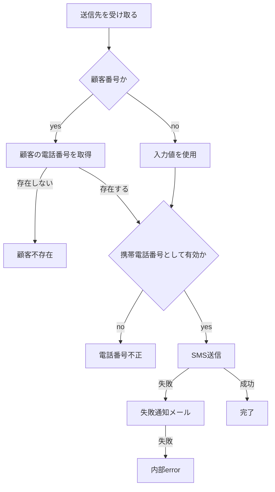

# 設計書形式

## ファイル

`.[agent_name]/prompt/`へ直接作成・更新する。

| file | 内容 |
|---|---|
| `.prompt.md` | 実装順の`- [ ] branch-<機能名>-prompt.md`だけ |
| `branch-<機能名>-prompt.md` | 単独で実装・完了判定できる1機能 |

機能名はASCII kebab-case。依存先を先に並べ、全項目を未完了で作る。`[x]`へ変えるのは`tdd --from-doc`だけ。

1枚を原則1 branch・squash後1 commitにする。APIとschema、migrationとschema変更、helper・定数と利用箇所、testと対象実装は同じ設計書。UIはcomponent単位。

## 必須section

````markdown
# <機能名>

## Summary
<目的・利用者に見える結果を1〜2行>

## Changes
<フロー図・状態遷移図・シーケンス図・決定表から主要なものを1つ>

<図だけでは確定しない入出力・不変条件・error・副作用・dataの権威を契約表で補足>

## 対象ファイル
- @<相対パス>

## 参照ルール
- @.[agent_name]/rules/<関連rule>

## 設計根拠
- <明示要件・禁止制約・受入済みtrade-off・既存制約／変更可能な設計選択>
- <新設要素のconsumer、同責務の既存例path:line・export、適用規約、代替案の不足>

## 完了条件
- <実装・検証・構造・配置・命名をこの1枚で判定できる条件>
````

## Changes

実装方法ではなく、外部から確認できる振る舞いと実装が守る契約を書く。複雑さの中心に応じて次から主要表現を1つ選ぶ。

| 複雑さの中心 | 表現 |
|---|---|
| 処理順・分岐 | Mermaid `flowchart` |
| lifecycle・再試行・取消 | Mermaid `stateDiagram-v2` |
| component・外部service間の通信順 | Mermaid `sequenceDiagram` |
| 条件の組み合わせ | Markdownの決定表 |

主要表現だけでは異なる種類の振る舞いを確定できない場合だけ2つ目を加える。file一覧、class構成、単一の直線処理は図にしない。

### 契約表

図または決定表にない該当項目だけを書く。非該当行、既存規約から一意に決まる実装、図と同じ内容は書かない。

| 項目 | 残す情報 |
|---|---|
| 入力・出力 | nullを含む入力形状、条件付き必須、公開する正常結果・field |
| 判定 | guardの優先順位、条件式、境界・等号、計算式、sort・tie-break |
| 不変条件 | 認証・整合性・重複・競合・data lossを防ぐ条件 |
| error | 発生条件、呼出元から区別する結果、既存dataの扱い |
| 副作用 | DB書き込み・メール・外部APIの順序、await、部分失敗時の扱い |
| dataの権威 | 判定に使う最新data、再取得・再検証・選択条件 |

既存symbol・schema field・file path・外部契約名は実名で書く。新設するlocal変数・関数内構造・実装時の英語名は固定しない。

### 例



| 項目 | 契約 |
|---|---|
| 判定 | `to`が`A`始まりなら`customer_no`で`prisma.user`を検索する。確定した電話番号は`^0[789]0\d{8}$`に一致必須 |
| 副作用 | `sendSMS`失敗時だけ`sendMail`を実行し、通知も失敗した場合は`InternalServerError` |

### 書かない情報

- `const`・`let`・`await`・object組立てなどの実装構文
- local変数名、関数内部のblock構造、新設symbolの実装時の英語名
- 既存patternと参照ruleから一意に決まるAPI・frameworkの呼び出し方
- 対象コードとtestから導出できる実装順
- Summary・完了条件・図・契約表の間の言い換え

図の簡略化のために、状態・event・guard・境界値・error・副作用・dataの権威を省略しない。対象file・参照ruleは正確な相対pathとする。
